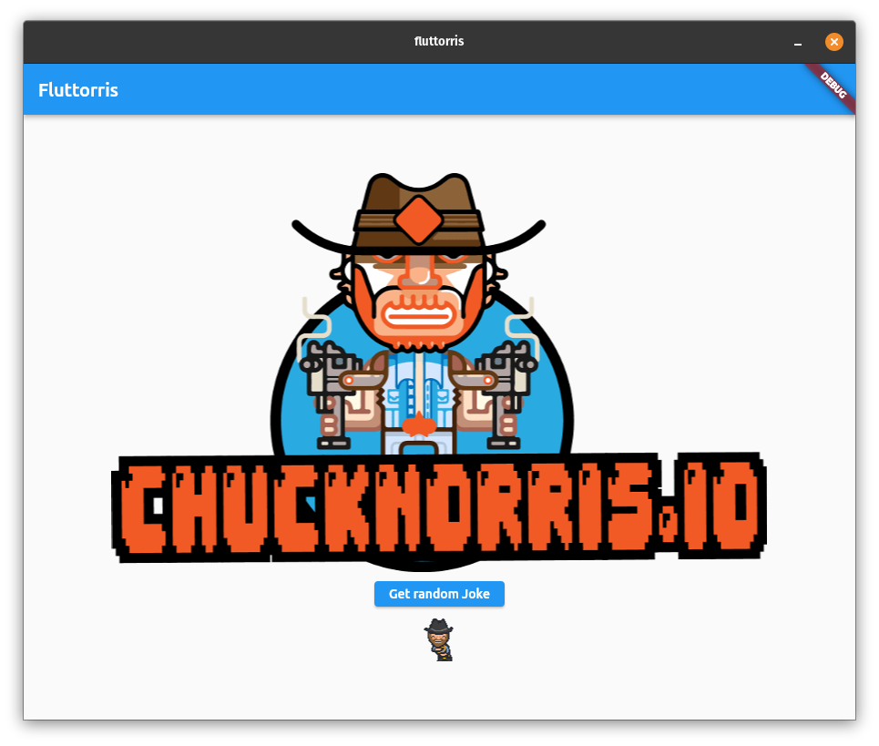

# fluttorris
Flutter implementation of Chuck Norris API desktop client.



## Setup on Debian based systems

Snap `core18` will be downloaded implicitly.

    sudo apt-get update; sudo apt-get install snapd; snap install flutter --classic

Check the installation.

```
$ which flutter dart
/snap/bin/flutter
/snap/bin/dart
```

Initialize Flutter.

```
$ flutter
Initializing Flutter
...
Downloading https://storage.googleapis.com/flutter_infra/releases/stable/linux/flutter_linux_2.2.1-stable.tar.xz
...
Flutter initialized
$ flutter config --enable-linux-desktop
$ flutter config --no-analytics
$ dart --disable-analytics
```

Install Chrome.

```
wget https://dl.google.com/linux/direct/google-chrome-stable_current_amd64.deb
sudo apt install ./google-chrome-stable_current_amd64.deb
```

For Linux desktop development there is no need for Android SDK, Android Studio and 

```
$ flutter doctor
Doctor summary (to see all details, run flutter doctor -v):
[✓] Flutter (Channel stable, 2.2.1, on Linux, locale en_AU.UTF-8)
[✗] Android toolchain - develop for Android devices
    ✗ Unable to locate Android SDK.
      Install Android Studio from: https://developer.android.com/studio/index.html
      On first launch it will assist you in installing the Android SDK components.
      (or visit https://flutter.dev/docs/get-started/install/linux#android-setup for detailed instructions).
      If the Android SDK has been installed to a custom location, please use
      `flutter config --android-sdk` to update to that location.

[✓] Chrome - develop for the web
[!] Android Studio (not installed)
[✓] VS Code (version 1.58.2)
[✓] Connected device (1 available)

! Doctor found issues in 2 categories.
```

Check devices.

```
$ flutter devices
2 connected devices:

Linux (desktop) • linux  • linux-x64      • Linux
Chrome (web)    • chrome • web-javascript • Google Chrome 94.0.46
```

